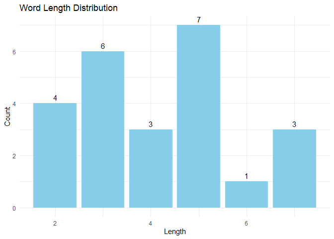
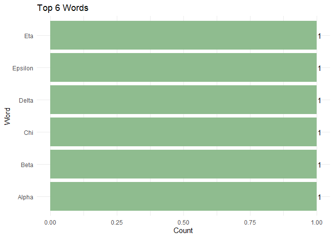

<!-- README.md is generated from README.Rmd. Please edit that file -->

# wordplay

<!-- badges: start -->

[](https://github.com/hlan22/wordplay/actions/workflows/R-CMD-check.yaml)
[](https://app.codecov.io/gh/hlan22/wordplay)
[](https://hlan22.github.io/wordplay/)

[](https://opensource.org/licenses/MIT)
[](https://creativecommons.org/publicdomain/zero/1.0/)
[](https://github.com/hlan22/wordplay/blob/main/DESCRIPTION)
<!-- [](https://github.com/hlan22/wordplay) -->
[](https://CRAN.R-project.org/package=wordplay)
<!-- badges: end -->

The aim of `wordplay` is to learn more about your favorite list of
words! Learn about metrics such as length, frequent starting letters,
and much more with ease!

#### Table of Contents

- [Installation](#installation)
- [Functions](#functions)
- [Dependencies](#dependencies)
- [Example Use](#example-use)
- [Code of Conduct](#code-of-conduct)
- [Licenses](#licenses)

## Installation

You can install the development version of `wordplay` from
[GitHub](https://github.com/) with:

``` r
install.packages("pak")

pak::pak("hlan22/wordplay")
```

## Functions

- `all_words_summary`
- `word_characteristics`
- `word_length_plot`
- `top_words_plot`

## Dependencies

The following R packages are used by this package:

- `dplyr`: 1.1.4
- `forcats`: 1.0.0
- `ggplot2`: 3.5.1
- `stats`: 4.4.1
- `stringr`: 1.5.1
- `stringi`: 1.8.4
- `tibble`: 3.2.1
- `testthat`: 3.2.1

## Example Use

This is a basic example which shows you how to solve a common problem:

``` r

library(wordplay)

# use example list of words, such as the greek alphabet
greek_alphabet <- data.frame(
  word = c(
    "Alpha", "Beta", "Gamma", "Delta", "Epsilon", "Zeta", "Eta", "Theta",
    "Iota", "Kappa", "Lambda", "Mu", "Nu", "Xi", "Omicron", "Pi", "Rho",
    "Sigma", "Tau", "Upsilon", "Phi", "Chi", "Psi", "Omega"
  ))

# learn about size of list and length of the words overall
all_words_summary(greek_alphabet)
#> # A tibble: 1 × 7
#>   total_words unique_words avg_length median_length sd_length longest_word
#>         <int>        <int>      <dbl>         <dbl>     <dbl> <chr>       
#> 1          24           24       4.17             4      1.61 Epsilon     
#> # ℹ 1 more variable: shortest_word <chr>

# learn about individual words themselves in a table
summary(word_characteristics(greek_alphabet))
#>      word               length          vowels        consonants   
#>  Length:24          Min.   :2.000   Min.   :1.000   Min.   :1.000  
#>  Class :character   1st Qu.:3.000   1st Qu.:1.000   1st Qu.:1.000  
#>  Mode  :character   Median :4.000   Median :2.000   Median :2.000  
#>                     Mean   :4.167   Mean   :1.875   Mean   :2.292  
#>                     3rd Qu.:5.000   3rd Qu.:2.000   3rd Qu.:3.000  
#>                     Max.   :7.000   Max.   :3.000   Max.   :4.000  
#>  is_palindrome   has_repeated_letters
#>  Mode :logical   Mode :logical       
#>  FALSE:24        FALSE:22            
#>                  TRUE :2             
#>                                      
#>                                      
#> 

# visualize the different lengths of words in the list
word_length_plot(greek_alphabet)
```



``` r

# learn if there are repeating words in the list; not applicable to this example
top_words_plot(greek_alphabet)
```



## Code of Conduct

Please note that `wordplay` is released with a [Code of
Conduct](https://hlan22.github.io/wordplay/CODE_OF_CONDUCT.md). By
contributing to this project, you agree to abide by its terms.

## Licenses

This project is dual-licensed under the following:

- **[Creative Commons Zero v1.0 Universal (CC0
  1.0)](https://creativecommons.org/publicdomain/zero/1.0/)** You can
  copy, modify, distribute and perform the work, even for commercial
  purposes, all without asking permission.

- **[MIT License](LICENSE-MIT.md)** A short and permissive software
  license. You can use it in proprietary software provided that all
  copies include the license terms and the copyright notice.
